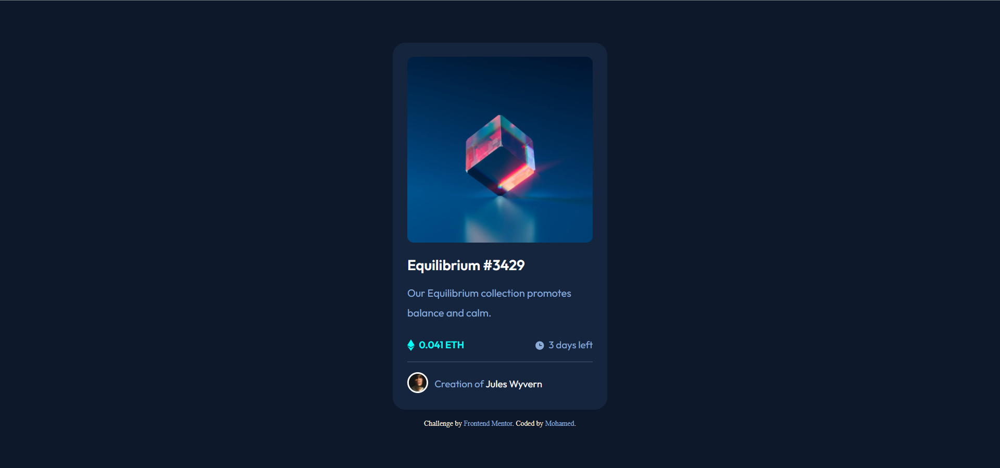

# Frontend Mentor - NFT preview card component solution
This is a solution to the [NFT preview card component challenge on Frontend Mentor](https://www.frontendmentor.io/challenges/nft-preview-card-component-SbdUL_w0U). 

## Table of contents

- [Frontend Mentor - NFT preview card component solution](#frontend-mentor---nft-preview-card-component-solution)
  - [Table of contents](#table-of-contents)
    - [The challenge](#the-challenge)
    - [Screenshot](#screenshot)
    - [Links](#links)
    - [Built with](#built-with)
  - [Author](#author)

### The challenge
Users should be able to:
- View the optimal layout depending on their device's screen size
- See hover states for interactive elements

### Screenshot

### Links
- Solution URL: (https://github.com/M0hamedF/NFT-Preview-Card)
- Live Site URL: (https://m0hamedf.github.io/NFT-Preview-Card/)

### Built with
- Semantic HTML5 markup
- CSS custom properties
- Flexbox
- CSS Grid

## Author
- Frontend Mentor - [@M0hamedF](https://www.frontendmentor.io/profile/M0hamedF)